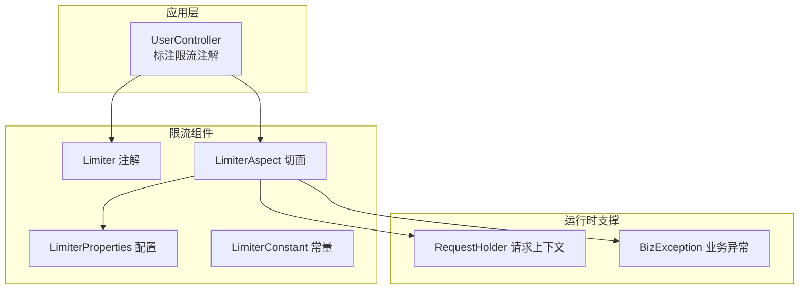
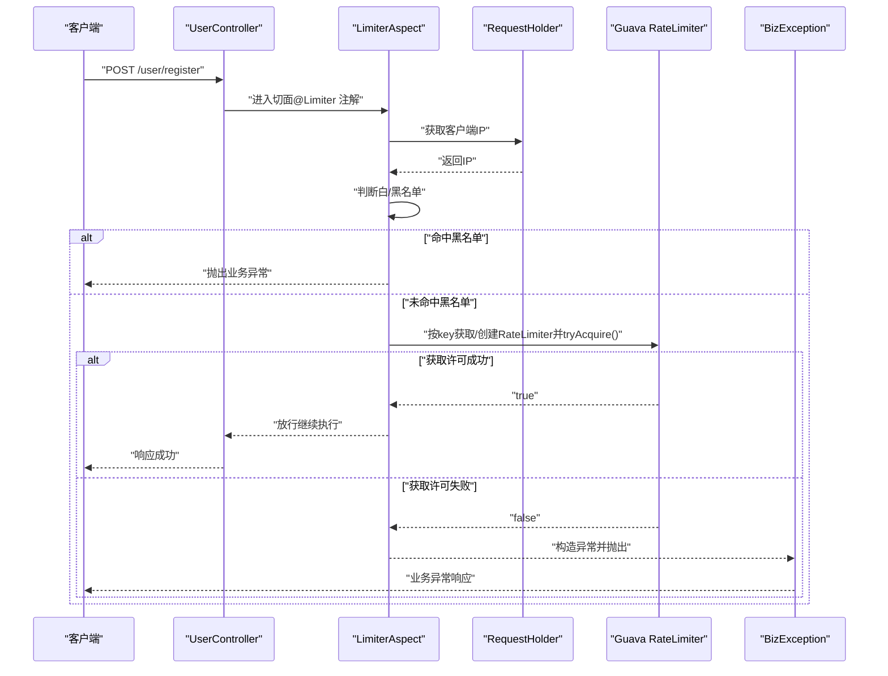
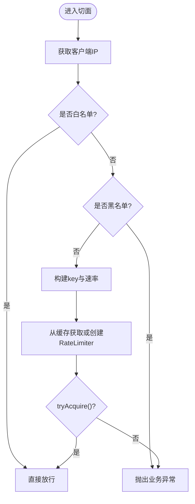
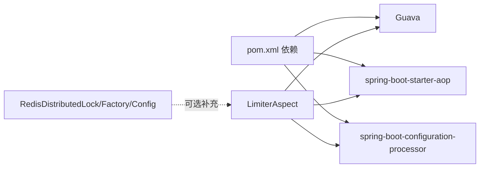

# 限流控制系统

<cite>
**本文引用的文件**
- [Limiter.java](file://src/main/java/com/dw/admin/components/limiter/Limiter.java)
- [LimiterAspect.java](file://src/main/java/com/dw/admin/components/limiter/LimiterAspect.java)
- [LimiterConstant.java](file://src/main/java/com/dw/admin/components/limiter/LimiterConstant.java)
- [LimiterProperties.java](file://src/main/java/com/dw/admin/components/limiter/LimiterProperties.java)
- [UserController.java](file://src/main/java/com/dw/admin/controller/UserController.java)
- [RequestHolder.java](file://src/main/java/com/dw/admin/common/utils/RequestHolder.java)
- [BizException.java](file://src/main/java/com/dw/admin/common/exception/BizException.java)
- [application.yml](file://src/main/resources/application.yml)
- [pom.xml](file://pom.xml)
- [RedisDistributedLock.java](file://src/main/java/com/dw/admin/components/redis/RedisDistributedLock.java)
- [RedisLockFactory.java](file://src/main/java/com/dw/admin/components/redis/RedisLockFactory.java)
- [RedisConfig.java](file://src/main/java/com/dw/admin/components/redis/RedisConfig.java)
</cite>

## 目录
1. [简介](#简介)
2. [项目结构](#项目结构)
3. [核心组件](#核心组件)
4. [架构总览](#架构总览)
5. [组件详解](#组件详解)
6. [依赖关系分析](#依赖关系分析)
7. [性能考量](#性能考量)
8. [故障排查指南](#故障排查指南)
9. [结论](#结论)
10. [附录](#附录)

## 简介
本技术文档围绕限流控制系统进行深入解析，覆盖注解与AOP切面的实现原理、限流算法选择与配置、规则定义与动态配置、状态持久化与分布式协调、性能影响与调优策略、监控与告警建议、以及与缓存/队列等其他限流手段的协同方案。目标读者为系统管理员与开发者，帮助快速理解与落地限流治理。

## 项目结构
限流控制位于组件层 components/limiter，采用注解+AOP的方式在方法级生效；同时结合全局异常处理与请求上下文工具，形成从“入口校验—速率控制—异常反馈”的闭环。

图表来源
- [UserController.java](file://src/main/java/com/dw/admin/controller/UserController.java#L36-L54)
- [Limiter.java](file://src/main/java/com/dw/admin/components/limiter/Limiter.java#L15-L32)
- [LimiterAspect.java](file://src/main/java/com/dw/admin/components/limiter/LimiterAspect.java#L55-L78)
- [LimiterProperties.java](file://src/main/java/com/dw/admin/components/limiter/LimiterProperties.java#L15-L27)
- [LimiterConstant.java](file://src/main/java/com/dw/admin/components/limiter/LimiterConstant.java#L9-L20)
- [RequestHolder.java](file://src/main/java/com/dw/admin/common/utils/RequestHolder.java#L59-L79)
- [BizException.java](file://src/main/java/com/dw/admin/common/exception/BizException.java#L11-L54)

章节来源
- [UserController.java](file://src/main/java/com/dw/admin/controller/UserController.java#L36-L54)
- [Limiter.java](file://src/main/java/com/dw/admin/components/limiter/Limiter.java#L15-L32)
- [LimiterAspect.java](file://src/main/java/com/dw/admin/components/limiter/LimiterAspect.java#L55-L78)
- [LimiterProperties.java](file://src/main/java/com/dw/admin/components/limiter/LimiterProperties.java#L15-L27)
- [LimiterConstant.java](file://src/main/java/com/dw/admin/components/limiter/LimiterConstant.java#L9-L20)
- [RequestHolder.java](file://src/main/java/com/dw/admin/common/utils/RequestHolder.java#L59-L79)
- [BizException.java](file://src/main/java/com/dw/admin/common/exception/BizException.java#L11-L54)

## 核心组件
- 注解 Limiter：在方法上声明限流参数，支持按方法限流与按“方法+客户端IP”限流两种粒度。
- 切面 LimiterAspect：基于AOP拦截标注了 Limiter 的方法，结合白/黑名单、IP识别与Guava RateLimiter进行许可获取。
- 配置 LimiterProperties：通过外部配置启用/禁用限流、配置黑白名单IP。
- 常量 LimiterConstant：统一配置前缀与切面执行顺序。
- 请求上下文 RequestHolder：提取真实客户端IP，兼容多种代理头。
- 业务异常 BizException：统一抛出限流触发的错误。

章节来源
- [Limiter.java](file://src/main/java/com/dw/admin/components/limiter/Limiter.java#L15-L32)
- [LimiterAspect.java](file://src/main/java/com/dw/admin/components/limiter/LimiterAspect.java#L55-L78)
- [LimiterProperties.java](file://src/main/java/com/dw/admin/components/limiter/LimiterProperties.java#L15-L27)
- [LimiterConstant.java](file://src/main/java/com/dw/admin/components/limiter/LimiterConstant.java#L9-L20)
- [RequestHolder.java](file://src/main/java/com/dw/admin/common/utils/RequestHolder.java#L59-L79)
- [BizException.java](file://src/main/java/com/dw/admin/common/exception/BizException.java#L11-L54)

## 架构总览
限流在请求进入控制器方法前，由切面统一拦截并执行限流判定。若命中白名单直接放行，若命中黑名单直接拒绝；否则根据注解参数选择按方法或按“方法+IP”的粒度计算速率，使用本地缓存的RateLimiter进行许可获取，失败则抛出业务异常。

图表来源
- [UserController.java](file://src/main/java/com/dw/admin/controller/UserController.java#L36-L54)
- [LimiterAspect.java](file://src/main/java/com/dw/admin/components/limiter/LimiterAspect.java#L55-L78)
- [RequestHolder.java](file://src/main/java/com/dw/admin/common/utils/RequestHolder.java#L59-L79)
- [BizException.java](file://src/main/java/com/dw/admin/common/exception/BizException.java#L11-L54)

## 组件详解

### 注解 Limiter
- 目标：方法级限流声明
- 关键字段
  - rate：按方法维度的速率（每秒可用许可数）
  - rateOfIp：按“方法+客户端IP”维度的速率（每秒可用许可数）
  - type：预留扩展字段（当前实现未使用）
- 作用：为切面提供限流参数，决定key与速率来源

章节来源
- [Limiter.java](file://src/main/java/com/dw/admin/components/limiter/Limiter.java#L15-L32)

### 切面 LimiterAspect
- 切入点：匹配所有带有 Limiter 注解的方法
- 执行顺序：通过常量设定较低优先级，确保在鉴权/权限等之后执行
- 核心流程
  - 提取客户端IP
  - 白名单直接放行
  - 黑名单抛出业务异常
  - 计算key与速率
    - 若注解提供rateOfIp则按“方法全限定名#方法名+IP”作为key
    - 否则按“方法全限定名#方法名”作为key
    - 速率取rateOfIp或rate
  - 使用本地缓存（基于Guava Cache）存储每个key对应的RateLimiter，支持访问过期回收
  - tryAcquire获取许可，成功则放行，失败则抛出业务异常

图表来源
- [LimiterAspect.java](file://src/main/java/com/dw/admin/components/limiter/LimiterAspect.java#L55-L78)
- [Limiter.java](file://src/main/java/com/dw/admin/components/limiter/Limiter.java#L15-L32)

章节来源
- [LimiterAspect.java](file://src/main/java/com/dw/admin/components/limiter/LimiterAspect.java#L55-L78)

### 配置 LimiterProperties 与 LimiterConstant
- 配置前缀：dwa.limiter
- 关键项
  - enable：是否启用限流（默认启用）
  - blackIps：黑名单IP集合（逗号分隔）
  - whiteIps：白名单IP集合（逗号分隔）
- 常量
  - 配置开关键名：dwa.limiter.enable
  - 切面执行顺序：-5

章节来源
- [LimiterProperties.java](file://src/main/java/com/dw/admin/components/limiter/LimiterProperties.java#L15-L27)
- [LimiterConstant.java](file://src/main/java/com/dw/admin/components/limiter/LimiterConstant.java#L9-L20)
- [application.yml](file://src/main/resources/application.yml#L33-L64)

### 请求上下文 RequestHolder
- 提供获取HttpServletRequest与客户端IP的能力
- 兼容常见代理头（如 x-forwarded-for、Proxy-Client-IP、WL-Proxy-Client-IP 等），并处理IPv6环回地址映射

章节来源
- [RequestHolder.java](file://src/main/java/com/dw/admin/common/utils/RequestHolder.java#L59-L79)

### 业务异常 BizException
- 统一的业务异常类型，便于上层统一捕获与处理
- 切面在限流触发时抛出，提示“资源不足，请稍后再试！”

章节来源
- [BizException.java](file://src/main/java/com/dw/admin/common/exception/BizException.java#L11-L54)

### 控制器使用示例
- UserController中多处使用@Limiter注解
  - 注册接口：按“方法+IP”限流，10秒1次
  - 登录接口：按“方法+IP”限流，2秒1次
- 说明：这些示例展示了如何在不同接口上按需施加限流策略

章节来源
- [UserController.java](file://src/main/java/com/dw/admin/controller/UserController.java#L36-L54)

## 依赖关系分析
- 限流核心依赖
  - Guava：提供RateLimiter与Cache，用于许可获取与限流器缓存
  - Spring AOP：提供@Aspect与@Around能力，实现方法拦截
  - Spring Boot Configuration Processor：支持配置元数据
- Redis组件（与限流无直接耦合，但可作为分布式协调与持久化补充）
  - RedisDistributedLock：基于Lua的原子加锁/续期/解锁
  - RedisLockFactory：锁实例工厂
  - RedisConfig：Jedis连接池配置

图表来源
- [pom.xml](file://pom.xml#L25-L163)
- [LimiterAspect.java](file://src/main/java/com/dw/admin/components/limiter/LimiterAspect.java#L55-L78)
- [RedisDistributedLock.java](file://src/main/java/com/dw/admin/components/redis/RedisDistributedLock.java#L26-L72)
- [RedisLockFactory.java](file://src/main/java/com/dw/admin/components/redis/RedisLockFactory.java#L15-L61)
- [RedisConfig.java](file://src/main/java/com/dw/admin/components/redis/RedisConfig.java#L21-L63)

章节来源
- [pom.xml](file://pom.xml#L25-L163)

## 性能考量
- 本地缓存与过期回收
  - 使用Guava Cache按key缓存RateLimiter，默认访问过期时间为10分钟，降低重复创建成本
- RateLimiter特性
  - 基于令牌桶模型，允许突发但受控；适合中低并发、需要平滑削峰的场景
- 适用场景
  - 单机限流：适合单实例部署或无共享状态的场景
  - 多实例部署：当前实现未跨实例共享状态，存在“同IP在不同实例上限流相互独立”的现象
- 调优建议
  - 合理设置rate/rateOfIp：参考接口平均耗时与峰值QPS，留出安全余量
  - 白/黑名单：将可信网段加入白名单，减少不必要的限流判断
  - 并发热点：对高并发接口，考虑在网关层或服务前增加队列/缓冲，再由限流切面兜底
  - 监控与告警：结合业务指标与日志，观察限流命中率与错误率，动态调整阈值

[本节为通用性能讨论，无需列出具体文件来源]

## 故障排查指南
- 症状：频繁出现“资源不足，请稍后再试！”
  - 排查要点
    - 检查rate/rateOfIp是否过小
    - 确认是否命中黑名单
    - 观察是否因IP变化导致key分散（按IP限流时）
- 症状：白名单未生效
  - 排查要点
    - 确认配置项blackIps/whiteIps格式与值正确
    - 检查IP提取逻辑是否符合代理链路
- 症状：多实例部署下限流不一致
  - 说明：当前实现为单机缓存，未做跨实例同步
  - 建议：结合Redis分布式锁或集中式限流（如网关层）实现跨实例协调

章节来源
- [LimiterAspect.java](file://src/main/java/com/dw/admin/components/limiter/LimiterAspect.java#L55-L78)
- [LimiterProperties.java](file://src/main/java/com/dw/admin/components/limiter/LimiterProperties.java#L15-L27)
- [RequestHolder.java](file://src/main/java/com/dw/admin/common/utils/RequestHolder.java#L59-L79)

## 结论
本限流系统以注解+AOP为核心，结合本地缓存与Guava RateLimiter，实现了灵活、易用且可控的限流能力。其优势在于配置简单、侵入性低；局限在于单机缓存，多实例部署需额外协调。建议在生产环境中配合监控告警、白/黑名单策略与网关层限流，形成多层次防护体系。

[本节为总结性内容，无需列出具体文件来源]

## 附录

### 限流算法与策略选择
- 当前实现
  - 算法：令牌桶（Guava RateLimiter）
  - 特点：允许突发、平滑削峰，适合中低并发场景
- 其他可选策略（概念性说明）
  - 令牌桶：适合突发流量但需限制平均速率
  - 漏桶：严格限制平均速率，削峰填谷
  - 计数器：简单直观，适合粗粒度限流
  - 滑动窗口：更精细的限流边界控制

[本节为概念性说明，无需列出具体文件来源]

### 动态配置机制
- 配置项
  - dwa.limiter.enable：启用/禁用限流
  - dwa.limiter.blackIps：黑名单IP集合
  - dwa.limiter.whiteIps：白名单IP集合
- 生效方式
  - 通过Spring Boot配置绑定到LimiterProperties，切面按需读取

章节来源
- [LimiterProperties.java](file://src/main/java/com/dw/admin/components/limiter/LimiterProperties.java#L15-L27)
- [LimiterConstant.java](file://src/main/java/com/dw/admin/components/limiter/LimiterConstant.java#L9-L20)
- [application.yml](file://src/main/resources/application.yml#L33-L64)

### 规则定义与示例
- 方法级限流
  - 使用rate字段，按方法维度限流
- 按IP+方法限流
  - 使用rateOfIp字段，针对同一方法的不同客户端IP分别计数
- 示例
  - 注册接口：按IP限流，10秒1次
  - 登录接口：按IP限流，2秒1次

章节来源
- [UserController.java](file://src/main/java/com/dw/admin/controller/UserController.java#L36-L54)
- [Limiter.java](file://src/main/java/com/dw/admin/components/limiter/Limiter.java#L15-L32)

### 分布式协调与持久化
- 当前实现
  - 限流状态仅在JVM内存缓存中，未做持久化
- 可选方案（概念性说明）
  - 使用Redis存储限流状态，实现跨实例共享
  - 结合Redis分布式锁，保证跨实例一致性
  - 与网关层（如Nginx/OpenResty/Ingress）配合，前置限流

章节来源
- [RedisDistributedLock.java](file://src/main/java/com/dw/admin/components/redis/RedisDistributedLock.java#L26-L72)
- [RedisLockFactory.java](file://src/main/java/com/dw/admin/components/redis/RedisLockFactory.java#L15-L61)
- [RedisConfig.java](file://src/main/java/com/dw/admin/components/redis/RedisConfig.java#L21-L63)

### 与缓存、队列的配合
- 缓存
  - 对热点接口先走缓存，再通过限流切面兜底，降低数据库压力
- 队列
  - 在高并发场景下，先入队列缓冲，再异步消费，限流切面用于保护下游系统
- 限流
  - 作为最后一道防线，防止雪崩与资源耗尽

[本节为通用协作建议，无需列出具体文件来源]

### 监控与告警建议
- 指标
  - 限流命中次数、失败次数、平均延迟、错误率
- 告警
  - 当限流命中率超过阈值或错误率异常升高时触发
- 工具
  - 结合Spring Boot Actuator与Prometheus/Grafana进行采集与可视化

[本节为通用监控建议，无需列出具体文件来源]