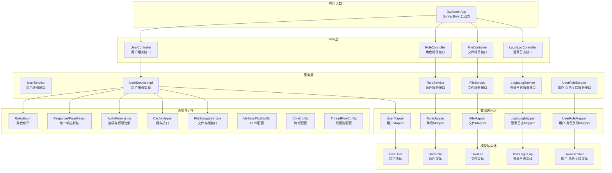
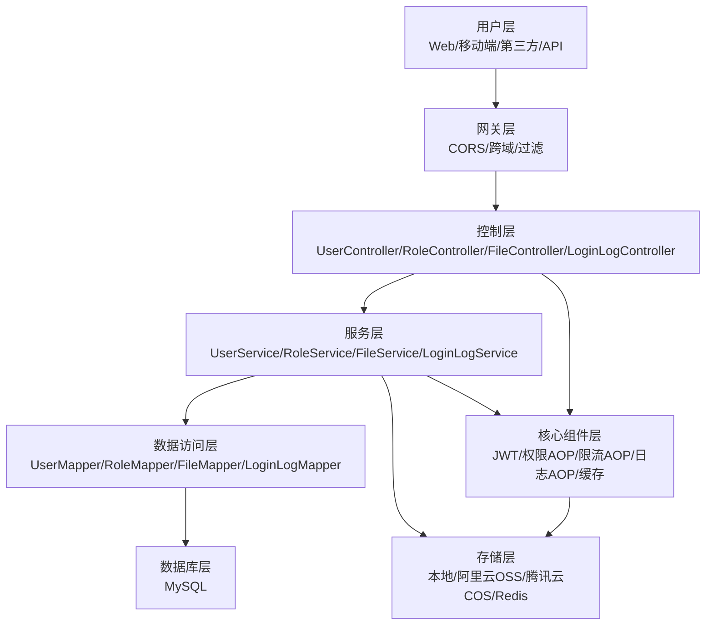
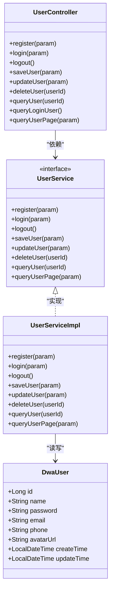
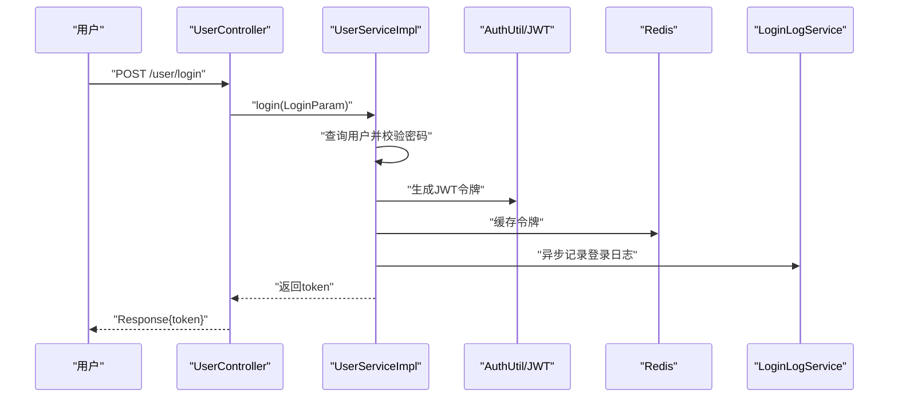
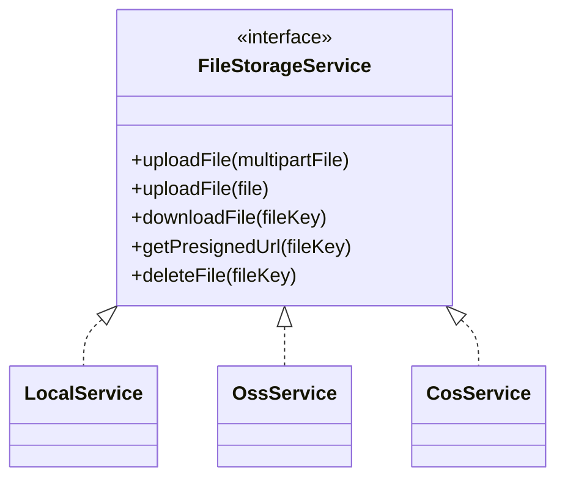
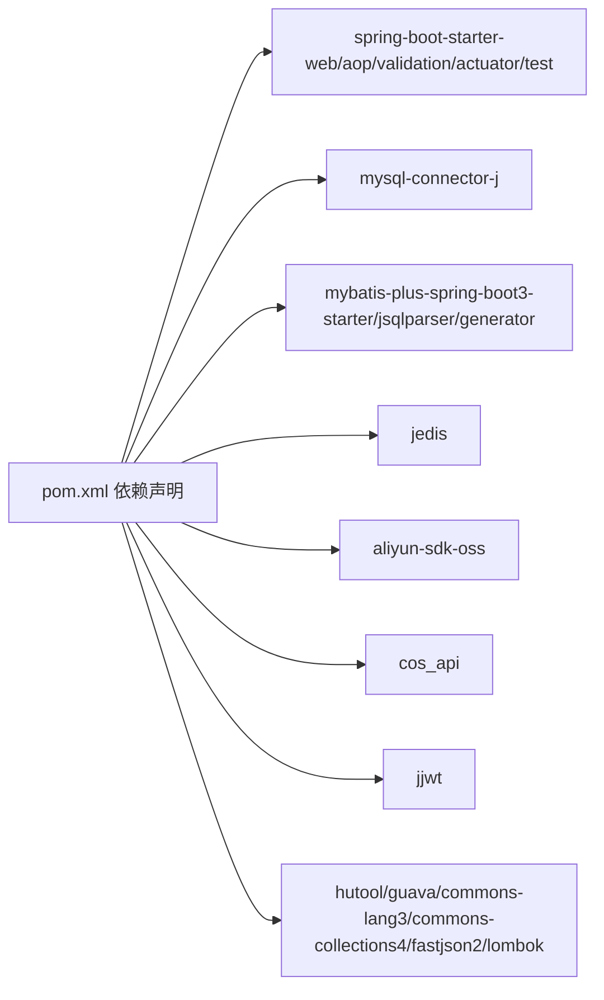

# 项目概述

<cite>
**本文引用的文件**
- [README.md](file://README.md)
- [DwAdminApp.java](file://src/main/java/com/dw/admin/DwAdminApp.java)
- [pom.xml](file://pom.xml)
- [application.yml](file://src/main/resources/application.yml)
- [技术架构图.md](file://docs/技术架构图.md)
- [双重云存储支持设计方案.md](file://docs/双重云存储支持设计方案.md)
- [UserController.java](file://src/main/java/com/dw/admin/controller/UserController.java)
- [UserService.java](file://src/main/java/com/dw/admin/service/UserService.java)
- [UserServiceImpl.java](file://src/main/java/com/dw/admin/service/impl/UserServiceImpl.java)
- [DwaUser.java](file://src/main/java/com/dw/admin/model/entity/DwaUser.java)
- [RolesEnum.java](file://src/main/java/com/dw/admin/common/enums/RolesEnum.java)
- [Auth.java](file://src/main/java/com/dw/admin/components/auth/Auth.java)
- [Permission.java](file://src/main/java/com/dw/admin/components/permission/Permission.java)
- [FileStorageService.java](file://src/main/java/com/dw/admin/components/storage/FileStorageService.java)
- [CacheHelper.java](file://src/main/java/com/dw/admin/components/cache/CacheHelper.java)
</cite>

## 目录
1. [引言](#引言)
2. [项目结构](#项目结构)
3. [核心组件](#核心组件)
4. [架构总览](#架构总览)
5. [详细组件分析](#详细组件分析)
6. [依赖分析](#依赖分析)
7. [性能考量](#性能考量)
8. [故障排查指南](#故障排查指南)
9. [结论](#结论)
10. [附录](#附录)

## 引言
DW后台管理系统是一个基于Spring Boot的企业级后台管理平台，聚焦于用户管理、权限控制、文件存储与统一认证鉴权等核心能力。项目采用分层架构与组件化设计，结合JWT无状态认证、AOP切面（权限、限流、日志）、多级缓存（Redis与本地缓存）以及统一文件存储接口（支持阿里云OSS与腾讯云COS），形成高可用、易扩展、可运维的技术体系。

本项目面向初学者提供循序渐进的概念讲解，同时为有经验的开发者提供深入的架构细节、组件关系与最佳实践参考。

## 项目结构
项目采用标准的Spring Boot多模块结构，按职责划分为controller、service、dao、model、common、components、config等层次，并通过MyBatis-Plus进行数据持久化，配合Redis实现高性能缓存与分布式锁，通过Maven统一依赖管理与构建。

图表来源
- [DwAdminApp.java](file://src/main/java/com/dw/admin/DwAdminApp.java#L11-L24)
- [UserController.java](file://src/main/java/com/dw/admin/controller/UserController.java#L25-L137)
- [UserService.java](file://src/main/java/com/dw/admin/service/UserService.java#L16-L58)
- [UserServiceImpl.java](file://src/main/java/com/dw/admin/service/impl/UserServiceImpl.java#L40-L269)
- [DwaUser.java](file://src/main/java/com/dw/admin/model/entity/DwaUser.java#L24-L72)
- [RolesEnum.java](file://src/main/java/com/dw/admin/common/enums/RolesEnum.java#L8-L30)
- [Auth.java](file://src/main/java/com/dw/admin/components/auth/Auth.java#L11-L16)
- [Permission.java](file://src/main/java/com/dw/admin/components/permission/Permission.java#L11-L22)
- [CacheHelper.java](file://src/main/java/com/dw/admin/components/cache/CacheHelper.java#L8-L51)
- [FileStorageService.java](file://src/main/java/com/dw/admin/components/storage/FileStorageService.java#L12-L51)

章节来源
- [README.md](file://README.md#L1-L51)
- [DwAdminApp.java](file://src/main/java/com/dw/admin/DwAdminApp.java#L11-L24)
- [pom.xml](file://pom.xml#L25-L163)
- [application.yml](file://src/main/resources/application.yml#L1-L64)

## 核心组件
- 应用入口与配置
  - 启动类启用异步与定时任务扫描Mapper包，统一对外暴露REST接口。
  - 通过application.yml集中配置数据库连接、文件上传限制、日志级别与dwa命名空间下的认证、Redis与存储配置。
- 用户管理
  - 控制器提供注册、登录、登出、保存/更新/删除、查询单个/分页查询等接口；服务层实现业务逻辑、参数校验、密码加密、登录日志异步记录与分页排序。
- 权限控制
  - 自定义注解@Auth与@Permission用于方法级鉴权与角色校验；结合AOP实现横切控制。
- 文件存储
  - 统一FileStorageService接口，支持本地、阿里云OSS与腾讯云COS；通过工厂模式按配置动态选择具体实现。
- 缓存与日志
  - CacheHelper提供基础KV缓存能力；全局异常与日志切面贯穿各层，保障可观测性与问题定位。

章节来源
- [DwAdminApp.java](file://src/main/java/com/dw/admin/DwAdminApp.java#L11-L24)
- [application.yml](file://src/main/resources/application.yml#L33-L64)
- [UserController.java](file://src/main/java/com/dw/admin/controller/UserController.java#L33-L135)
- [UserService.java](file://src/main/java/com/dw/admin/service/UserService.java#L16-L58)
- [UserServiceImpl.java](file://src/main/java/com/dw/admin/service/impl/UserServiceImpl.java#L57-L267)
- [Auth.java](file://src/main/java/com/dw/admin/components/auth/Auth.java#L11-L16)
- [Permission.java](file://src/main/java/com/dw/admin/components/permission/Permission.java#L11-L22)
- [FileStorageService.java](file://src/main/java/com/dw/admin/components/storage/FileStorageService.java#L12-L51)
- [CacheHelper.java](file://src/main/java/com/dw/admin/components/cache/CacheHelper.java#L8-L51)

## 架构总览
系统采用经典的分层架构：用户层（Web/移动端/第三方/API）→ 网关层（CORS/跨域/过滤）→ 控制层（Controller）→ 服务层（Service）→ 数据访问层（DAO/MyBatis-Plus）→ 核心组件层（认证授权/JWT/权限AOP/限流AOP/日志AOP）→ 存储层（本地/OSS/COS/Redis）→ 数据库层（MySQL）。请求在进入业务逻辑前经过鉴权、参数校验、权限检查与限流控制，返回时统一封装为标准响应格式。

图表来源
- [技术架构图.md](file://docs/技术架构图.md#L3-L94)
- [UserController.java](file://src/main/java/com/dw/admin/controller/UserController.java#L25-L137)
- [UserService.java](file://src/main/java/com/dw/admin/service/UserService.java#L16-L58)
- [application.yml](file://src/main/resources/application.yml#L33-L64)

章节来源
- [技术架构图.md](file://docs/技术架构图.md#L1-L216)

## 详细组件分析

### 用户管理模块
- 控制器层
  - 提供注册、登录、登出、保存/更新/删除、查询单个/分页查询等REST接口；对敏感操作标注@Auth与@Permission，对高频接口标注@Limiter进行限流保护。
- 服务层
  - 实现注册校验（用户名唯一）、登录校验（用户名存在与密码匹配）、生成JWT令牌、记录登录日志（异步）、用户信息保存/更新/删除、分页查询与排序。
- 实体与模型
  - DwaUser包含用户基本信息与时间字段；通过Bean拷贝转换为VO返回。
- 角色与权限
  - RolesEnum定义角色编码与消息；@Permission注解用于方法级角色校验。

图表来源
- [UserController.java](file://src/main/java/com/dw/admin/controller/UserController.java#L25-L137)
- [UserService.java](file://src/main/java/com/dw/admin/service/UserService.java#L16-L58)
- [UserServiceImpl.java](file://src/main/java/com/dw/admin/service/impl/UserServiceImpl.java#L40-L269)
- [DwaUser.java](file://src/main/java/com/dw/admin/model/entity/DwaUser.java#L24-L72)

章节来源
- [UserController.java](file://src/main/java/com/dw/admin/controller/UserController.java#L33-L135)
- [UserService.java](file://src/main/java/com/dw/admin/service/UserService.java#L16-L58)
- [UserServiceImpl.java](file://src/main/java/com/dw/admin/service/impl/UserServiceImpl.java#L57-L267)
- [DwaUser.java](file://src/main/java/com/dw/admin/model/entity/DwaUser.java#L24-L72)
- [RolesEnum.java](file://src/main/java/com/dw/admin/common/enums/RolesEnum.java#L8-L30)

### 认证与权限控制
- 认证
  - 登录成功后生成JWT令牌，设置过期时间，并将令牌与用户信息缓存至Redis；登出时移除令牌。
- 权限
  - 通过@Auth与@Permission注解结合AOP实现方法级鉴权与角色校验；支持本地缓存与Redis缓存的多级权限映射。
- 限流与日志
  - @Limiter注解用于接口限流；@Log注解用于统一记录操作日志与登录日志。

图表来源
- [UserController.java](file://src/main/java/com/dw/admin/controller/UserController.java#L48-L54)
- [UserServiceImpl.java](file://src/main/java/com/dw/admin/service/impl/UserServiceImpl.java#L77-L108)
- [application.yml](file://src/main/resources/application.yml#L33-L37)

章节来源
- [Auth.java](file://src/main/java/com/dw/admin/components/auth/Auth.java#L11-L16)
- [Permission.java](file://src/main/java/com/dw/admin/components/permission/Permission.java#L11-L22)
- [application.yml](file://src/main/resources/application.yml#L33-L37)

### 文件存储模块
- 统一接口
  - FileStorageService定义上传、下载、获取预签名URL、删除等标准方法，屏蔽底层差异。
- 多存储后端
  - 支持本地文件系统、阿里云OSS与腾讯云COS；通过配置选择存储提供商，工厂模式按需返回具体实现。
- 配置与URL
  - application.yml中dwa.storage提供provider与各云厂商的密钥、Endpoint、Bucket、前缀路径与URL过期时间等配置。

图表来源
- [FileStorageService.java](file://src/main/java/com/dw/admin/components/storage/FileStorageService.java#L12-L51)
- [application.yml](file://src/main/resources/application.yml#L40-L64)
- [双重云存储支持设计方案.md](file://docs/双重云存储支持设计方案.md#L18-L52)

章节来源
- [FileStorageService.java](file://src/main/java/com/dw/admin/components/storage/FileStorageService.java#L12-L51)
- [application.yml](file://src/main/resources/application.yml#L40-L64)
- [双重云存储支持设计方案.md](file://docs/双重云存储支持设计方案.md#L1-L448)

### 缓存与日志
- 缓存接口
  - CacheHelper提供exists/get/set/delete等基础KV缓存能力，支持带过期时间的设置。
- 日志
  - 通过@Log注解与LogAspect实现统一日志记录，覆盖操作日志与登录日志。

章节来源
- [CacheHelper.java](file://src/main/java/com/dw/admin/components/cache/CacheHelper.java#L8-L51)

## 依赖分析
- 技术栈
  - Web框架：Spring Boot
  - ORM：MyBatis-Plus
  - 数据库：MySQL
  - 缓存：Redis
  - 对象存储：阿里云OSS、腾讯云COS
  - 认证：JWT
  - 工具库：Hutool、Guava、Apache Commons等
  - 日志：Logback
- 依赖关系
  - 控制器依赖服务接口；服务实现依赖DAO与组件（缓存、存储、鉴权）；DAO依赖MyBatis-Plus与数据库；应用配置集中在application.yml。

图表来源
- [pom.xml](file://pom.xml#L25-L163)

章节来源
- [pom.xml](file://pom.xml#L25-L163)
- [application.yml](file://src/main/resources/application.yml#L1-L64)

## 性能考量
- 分层与AOP
  - 通过鉴权、权限、限流与日志AOP减少重复代码，提升可维护性与安全性。
- 缓存策略
  - Redis用于令牌与权限缓存，本地缓存作为L1缓存，降低数据库压力与延迟。
- 存储抽象
  - 统一接口与工厂模式便于按需选择最优存储后端，结合URL预签名降低回源压力。
- 数据库与ORM
  - MyBatis-Plus提供高效分页与条件构造器，合理索引与查询条件可显著提升查询性能。
- 并发与异步
  - 登录日志异步记录避免阻塞主流程；线程池配置可按业务峰值调整。

## 故障排查指南
- 启动与连接
  - 确认数据库连接参数与账号密码正确；检查Redis连接与密码配置；确认端口未被占用。
- 认证失败
  - 检查JWT密钥与过期时间配置；确认Redis中是否存在对应令牌缓存；核对@Auth/@Permission注解是否正确标注。
- 文件存储异常
  - 核对dwa.storage.provider与对应云厂商配置；检查AccessKey/SecretKey/Endpoint/Bucket/Region等参数；确认URL过期时间合理。
- 日志与监控
  - 查看Logback输出与日志级别；关注@Log与限流AOP产生的日志；结合Actuator端点进行健康检查。

章节来源
- [application.yml](file://src/main/resources/application.yml#L9-L64)
- [技术架构图.md](file://docs/技术架构图.md#L155-L169)

## 结论
DW后台管理系统以清晰的分层架构与高度组件化为核心，结合JWT认证、AOP权限与限流、多级缓存与统一文件存储接口，构建了稳定、可扩展且易运维的后台管理平台。通过配置驱动与工厂模式，系统在不改动业务代码的前提下即可灵活切换存储后端与调整行为策略，满足不同业务场景与成本优化需求。

## 附录
- 快速开始
  - 清理：mvn clean
  - 编译：mvn compile
  - 运行：mvn spring-boot:run
  - 停止：./stop.sh
  - 打包：mvn install -Dmaven.test.skip=true
  - 运行JAR：java -jar target/dw-admin-1.0.0.jar
  - 构建镜像：docker build -t dw-admin:1.0.0 .
  - 运行容器：docker run -d -p 8020:8020 -v ./logs:/app/logs -e TZ=Asia/Shanghai -e SPRING_PROFILES_ACTIVE=dev --name dw-admin dw-admin:1.0.0

章节来源
- [README.md](file://README.md#L7-L50)